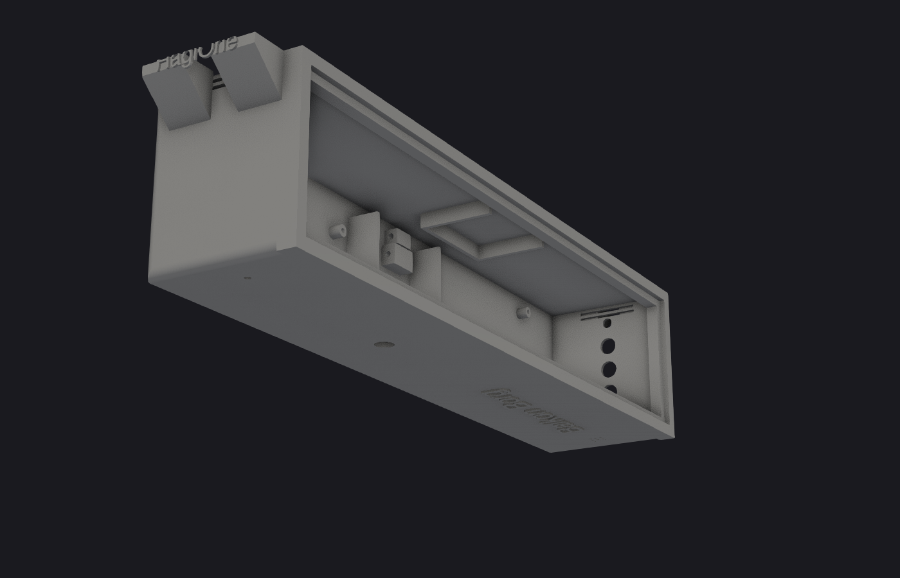
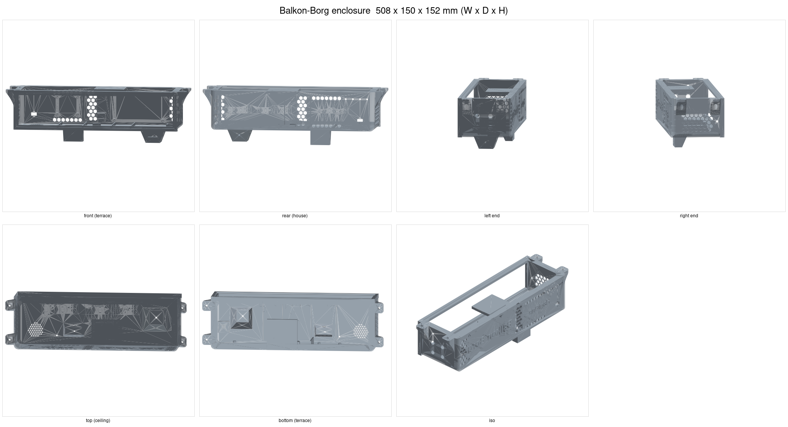
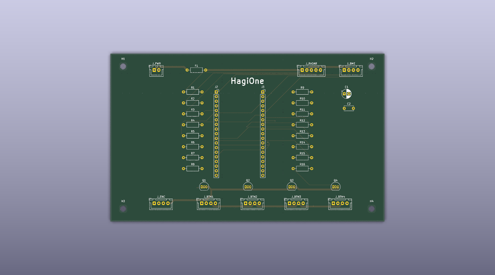
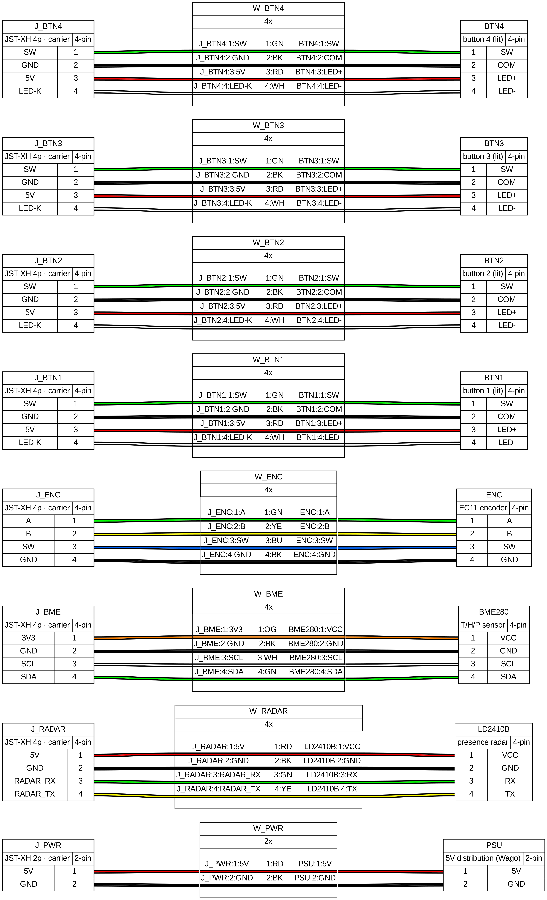
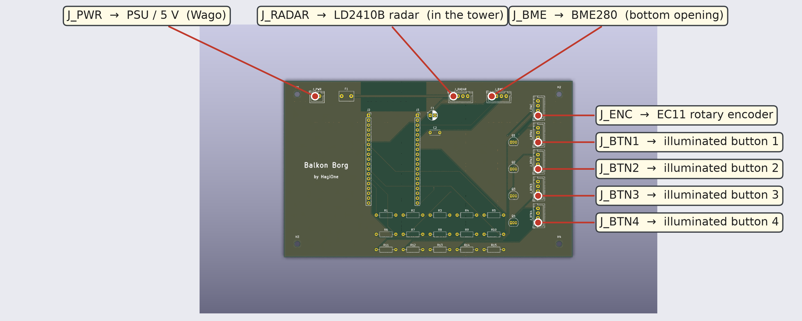

# Balkon-Borg

## Assimilating vision, audio, and the radio spectrum - balcony intelligence

*Note: 'Balkon' is German for balcony. Alternatively, call it the ÜberBorg, as it hangs
"über" (over/above) you.*

A smart, local sensor-and-effector node for the balcony, tied into the home network.

**Sensors**

- Vision: camera (Raspberry Pi Camera Module 3; Frigate for person, animal and gesture recognition)
- Motion: radar (LD2410B; presence and motion detection)
- Acoustics: USB microphone (BirdNET, noise-level monitoring, audio event classification)
- Environment: sensor (BME280; temperature, humidity, pressure)
- Radio: SDR receiver (RTL-SDR V4; aircraft/ADS-B, FM/DAB+ and AM/shortwave broadcast (built-in HF front end), LoRa, 433/868 MHz weather and smart-home sensors, tire-pressure sensors/TPMS)
- Controls: physical interface (four illuminated buttons and a rotary encoder)

**Effectors**

- Light: LED panel (WLED RGBW via an Athom high-power controller; ambient to dynamic effects)
- Audio: speaker (Visaton BF 45 via a PAM8403 amp and a USB DAC; situational feedback and voice clips)
- Data: network stream (MQTT; telemetry to the borg-pi5 hub for dashboards and storage, reachable from outside through the always-on nas-Pi)

**Hardware core**

Raspberry Pi 5 ("borg-pi5") and a low-solder ESP32 front panel, off one shared 5 V feed.

<p align="center"></p>

---

## Preview

Enclosure (SLS/PA12, rounded edges, ceiling-mount ears, slogans embossed) and the
ESP32 sensor carrier board (fully placed and routed). **Click the enclosure image to
open the STL in GitHub's interactive 3D viewer** (`docs/img/enclosure.stl`, exported
by `make render`):

[](docs/img/enclosure.stl)

All sides of the current enclosure model, regenerated from the CAD with
`make -C cad views` (shaded views montaged by ImageMagick):





### Wiring

The cable harness from the carrier board's JST connectors to the external components,
shown two ways. Both are **generated from the netlist** (see
[`docs/img/SOURCES.md`](docs/img/SOURCES.md) for exactly what each image derives from):

**Click either image to open it full resolution** (harness as zoomable SVG, board as the
300 dpi PNG).

Schematic harness (pinout + wire colours), rendered by **WireViz** from
[`pcb/wiring-harness.yaml`](pcb/wiring-harness.yaml):

[](docs/img/wiring-harness.svg)

The same connections on the board render, with callouts placed by
[`pcb/annotate-board.py`](pcb/annotate-board.py) from the connector positions
([full-resolution PNG](docs/img/board-annotated.png)):

[](docs/img/board-annotated.png)

Terminal assignment and the GPIO/I²C/Wago plan behind these images live in
[`docs/wiring.md`](docs/wiring.md).

---

## Documentation

- **Start here:** [decision log](log/decisions.md) (why the build is the way it is) ·
  [design review](docs/design-review.md) (open issues, ranked) ·
  [cost estimate](docs/cost-estimate.md)
- **Build & hardware:** [network](docs/network.md) (who is on when, MQTT flow + sequence) ·
  [light scenarios](docs/light-scenarios.md) ·
  [enclosure & SLS printing](docs/enclosure-sintering.md) ·
  [build/integration notes](docs/build-notes.md) ·
  [power distribution](docs/power-distribution.md) ·
  [carrier board spec](pcb/docs/board-spec.md)
- **Domains:** [`cad/`](cad/README.md) (enclosure) ·
  [`pcb/`](pcb/README.md) (carrier board) ·
  [`firmware/esphome/`](firmware/esphome/README.md) (ESP32)
- **Bonus:** the full illustrated build manual as a PDF (parts list, soldering, wiring
  with colour-coded connection tables), [Deutsch](manual/manual-de.pdf) ·
  [English](manual/manual-en.pdf)

---

## 1 · Short description

A compact enclosure, screwed under the balcony (above the terrace, ~2 m from the
dining table), bundling several functions: mood-to-party lighting, presence and
environment sensing, aircraft reception (ADS-B) and bird-call recognition. Everything
runs off a shared 5 V feed and an MQTT/WiFi bus. The goal is a build that looks
*intentional* (one box, one light field, minimal cabling) rather than tinkered.

## 2 · Goals

- **One visible box, minimal cabling**: exactly one 230 V feed, everything else 5 V + radio.
- **Value over gimmick**: automations and data actually used day to day (light at the table, weather, birds, aircraft).
- **Cleanly integrated into the existing setup**: MQTT bus, Podman/Quadlets, Netdata/Grafana.
- **Maintainable and extensible**: low-solder, pre-flashed components; enclosure as parametric code (CadQuery), not a throwaway click model.
- **Reliable continuous outdoor operation** (protected), thermally and electrically designed for summer duty.

## 3 · Use cases

| # | Use case | Realisation |
|---|---|---|
| U1 | Light at the dining table, automatic in the evening | SK6812 RGBW panel (WLED) + LD2410B radar → soft fade-in on presence, warm-white channel |
| U2 | Manual light control without a phone | 4× stainless buttons + rotary encoder (on/off, scenes, dimming, automation pause) |
| U3 | Effect / party light | WLED 2D effects, strobe, scrolling text on the 8×25 matrix |
| U4 | Environment data | BME280 (temperature/humidity/pressure) → MQTT → dashboard |
| U5 | Aircraft reception | RTL-SDR V4 + readsb/tar1090 (approach MUC, optional feed) |
| U6 | Bird-call log | USB microphone → BirdNET → species statistics over the season |
| U7 | Camera + local recognition | Camera Module 3 → Frigate (people/animals) **on the Pi 5 CPU** |
| U8 | Passive radio listening (optional) | LoRa/Meshtastic **RX** over the SDR (no active transmit node) |
| U9 | Audio feedback | small **USB speaker** on the borg-pi5 → plays a short clip / says hello when something is detected |

More use-case ideas (radar zones, SDR reception, sensor combinations, …) are collected
for rating in [`docs/ideas.md`](docs/ideas.md), an idea pool, not committed scope.

## 4 · System components (current state)

- **Central compute (borg-pi5):** Raspberry Pi 5 (8 GB) + Active Cooler, microSD in the enclosure, **the hub the project is about**: recording (camera/audio/SDR), local inference (Frigate, readsb/tar1090, BirdNET-Go), and the **MQTT broker (Mosquitto), dashboards and app**. Powered on **only when needed**, not 24/7.
- **Sensor/control front panel:** ESP32 (ESPHome) with LD2410B (UART), BME280 (I²C), 4 buttons + encoder (GPIO).
- **Light:** Athom high-power WLED controller + SK6812 RGBW-WW light field: 8 rows of 60/m strip, 25 LEDs each = 200 px, on a 3 mm aluminium plate (438 × 88, bought cut to size), opal acrylic diffuser.
- **Reception:** RTL-SDR V4 (ADS-B 1090 MHz, FM/DAB+/shortwave listening, optional LoRa RX), USB microphone (on the Pi 5). The LD2410B radar points **forward** (in the LED tower), toward the terrace.
- **Audio out:** USB sound card (C-Media, e.g. DELOCK 61645) + a **PAM8403** mini class-D amp + a **Visaton BF 45** broadband speaker on the borg-pi5, plays a short wav on events (detection, greeting). The Pi 5 has no analogue output, hence the USB card; amp powered off the Pi's 5 V branch (see [power](docs/power-distribution.md)).
- **Power:** Mean Well LRS-150F-5 (5 V/22 A) in its own V-0 enclosure, fused branches.
- **Enclosure:** 3D print in SLS/PA12 (black), **two halves** split at X=0 (each ~254 mm, fits a standard SLS bed such as JLC3DP), bolted with internal M3 seam clamps and 4 mm dowel pins; aluminium plate = front + heatsink.
- **nas-Pi5 (existing, minor role):** a separate, **always-on** Raspberry Pi 5 wired to the Fritz!Box. Only the **remote-access point** (reach the unit from outside) and occasional **image/data storage**, not the hub (see [network](docs/network.md)).

## 5 · Architecture and data flow

The **borg-pi5** is the hub: it captures camera (CSI), audio (USB) and RF (USB SDR), runs
the object recognition locally, and hosts the **MQTT broker, dashboards and app**, only
events and metadata go on over MQTT, no continuous raw stream. The **ESP32** handles the
human-facing, real-time-critical I/O (buttons, encoder, radar) and the slow environment
sensors; it is deliberately the *cheap, replaceable front panel*. The **nas-Pi5** is only
a minor, always-on helper (remote access + occasional image storage); the borg-pi5 runs
when needed, so its light/MQTT automation is available while it is on. Path: borg-pi5 →
WiFi repeater → cable → Fritz!Box → nas-Pi5 (see [network](docs/network.md)).

## 6 · Constraints

**Environment**
- Mounting location on the balcony underside: **rain-protected**, but raised humidity possible; Munich **summer heat** is relevant.
- No true IP65 needed (protected location) → **ventilated** enclosure with slits facing down + insect protection.

**Electrical**
- Exactly **one 230 V feed** (terrace socket, RCD-protected); target picture "no thousand cables".
- One shared **5 V PSU**, fused branches (10 A LED / 5 A Pi / 2 A small electronics), common GND, trimmer to **5.15 V**.
- **Fire safety:** the 230 V PSU **separated** from the printed part (its own V-0/metal enclosure); the printed part carries low voltage only.

**Thermal**
- **Aluminium plate = heatsink** of the LED layer, thermal contact to the enclosure (thermal pad at the supports).
- Pi 5 continuous load (now incl. **CPU object recognition**) → Active Cooler + ventilation are critical, not optional.
- WLED **Automatic Brightness Limiter** at ~8 A → caps the panel's heat and current.

**Mechanical / manufacturing**
- **3D print in SLS/PA12**, black-dyed (no supports, no layer lines, production look). See `docs/enclosure-sintering.md`.
- Printed as **two halves** (each ~254 mm, fits a standard SLS bed) and bolted together with M3 seam clamps and 4 mm dowel pins; black PA12 (e.g. JLC3DP 3201PA-F). Splitting keeps it off the expensive large-bed services.
- Radar sits in the LED tower (forward view); the **camera looks forward** to the terrace from a downward-hanging box (open at the top, set back, tilted ~24° down so the housing stays out of frame), not straight down.

**Network**
- WiFi + MQTT as the bus; **Ethernet optional** (only makes the video stream more bulletproof).

**Skill level / preferences**
- Soldering and programming available, **not a full tinkerer** → solder-free/pre-flashed parts preferred (Athom pre-flashed, pluggable LED connectors, buttons with a pigtail).
- **Quality over price**: reflected in RGBW-WW (real warm white), stainless buttons, SLS.

**Budget**
- **~415 €** new parts + **~40 €** odds and ends (connectors, fuses, Wago, wire, screws, inserts, glands). Camera and NAS-Pi already on hand.

## 7 · Deliberately out of scope (with consequence)

| Dropped | Consequence |
|---|---|
| **E-ink status display** | Data shown only via the existing dashboards (Grafana/tar1090). |
| **AI HAT / Hailo NPU** | Object recognition runs on the **Pi 5 CPU** (one camera stream ok, lower FPS); **retrofittable** any time, the PCIe port stays free (optional NVMe SSD). |
| **Heltec / active Meshtastic node** | LoRa **receive** only over the SDR, no transmit into the mesh. |
| **AS3935 lightning sensor** | No local thunderstorm early warning. |
| **Stairville Wild Wash + USB-DMX** | No separate blinder; effect/strobe light comes from the WLED panel itself. |

## 8 · Open points / next steps

1. **Terminal assignment**: concrete ESP32 GPIOs, I²C addresses (BME280), Wago plan of the 5 V distribution.
2. **Podman quadlets**: Mosquitto, Frigate (CPU detector), readsb/tar1090, BirdNET-Go.
3. **Real board measurement** → adjust the mounting-boss positions in `balkon_borg.py` (CadQuery).
4. **WLED config**: 2D 25×8 serpentine, ABL at 8 A, presets/scenes + button mapping.
5. **PSU**: EEPROM `PSU_MAX_CURRENT=5000`, trim the output to 5.15 V.
6. **Fit test**: print a corner/brow (insert and diffuser-rebate fit) before the two-half print.

## 9 · Key risks

- **Thermal in summer**: CPU detection raises the continuous load; ventilation and the Active Cooler decide stability.
- **Recognition performance**: without an NPU, FPS/stream limited; possibly a lighter model or a later Hailo retrofit.
- **Humidity/condensation**: mind the downward ventilation and possibly pressure equalisation so nothing collects.

## 10 · Built with Claude (Fable 5)

The complete hardware design in this repo, the parametric CadQuery enclosure, the
SKiDL → KiCad → Freerouting carrier board, the ESPHome firmware, the MQTT/Podman
plumbing and the docs, was generated in collaboration with Anthropic's **Claude**
**Fable 5**, driving the CAD, PCB, render and review tooling directly.
For the curious, a `/context` snapshot from one of the working sessions:

```text
Context Usage
⛁ ⛁ ⛁ ⛁ ⛀ ⛁ ⛁ ⛁ ⛁ ⛁ ⛁ ⛁ ⛁ ⛁ ⛁ ⛁ ⛁ ⛁ ⛁ ⛁   Fable 5
⛁ ⛁ ⛁ ⛁ ⛁ ⛁ ⛁ ⛁ ⛁ ⛁ ⛁ ⛁ ⛁ ⛁ ⛁ ⛁ ⛁ ⛁ ⛁ ⛁   claude-fable-5
⛁ ⛁ ⛁ ⛁ ⛁ ⛁ ⛁ ⛁ ⛁ ⛁ ⛁ ⛁ ⛁ ⛁ ⛁ ⛁ ⛁ ⛁ ⛁ ⛁   323k/1m tokens (32%)
⛁ ⛁ ⛁ ⛁ ⛁ ⛀ ⛶ ⛶ ⛶ ⛶ ⛶ ⛶ ⛶ ⛶ ⛶ ⛶ ⛶ ⛶ ⛶ ⛶
⛶ ⛶ ⛶ ⛶ ⛶ ⛶ ⛶ ⛶ ⛶ ⛶ ⛶ ⛶ ⛶ ⛶ ⛶ ⛶ ⛶ ⛶ ⛶ ⛶   Estimated usage by category
⛶ ⛶ ⛶ ⛶ ⛶ ⛶ ⛶ ⛶ ⛶ ⛶ ⛶ ⛶ ⛶ ⛶ ⛶ ⛶ ⛶ ⛶ ⛶ ⛶   ⛁ System prompt:  3.9k tokens (0.4%)
⛶ ⛶ ⛶ ⛶ ⛶ ⛶ ⛶ ⛶ ⛶ ⛶ ⛶ ⛶ ⛶ ⛶ ⛶ ⛶ ⛶ ⛶ ⛶ ⛶   ⛁ System tools:   8.8k tokens (0.9%)
⛶ ⛶ ⛶ ⛶ ⛶ ⛶ ⛶ ⛶ ⛶ ⛶ ⛶ ⛶ ⛶ ⛶ ⛶ ⛶ ⛶ ⛶ ⛶ ⛶   ⛁ Memory files:   5.6k tokens (0.6%)
⛶ ⛶ ⛶ ⛶ ⛶ ⛶ ⛶ ⛶ ⛶ ⛶ ⛶ ⛶ ⛶ ⛶ ⛶ ⛶ ⛶ ⛶ ⛶ ⛶   ⛁ Skills:         2.6k tokens (0.3%)
⛶ ⛶ ⛶ ⛶ ⛶ ⛶ ⛶ ⛶ ⛶ ⛶ ⛶ ⛶ ⛶ ⛶ ⛶ ⛶ ⛶ ⛶ ⛶ ⛶   ⛁ Messages:     302.8k tokens (30.3%)
                                        ⛶ Free space:   676.4k (67.6%)

MCP tools · 25 tools · loaded on-demand
Memory files · 3 files · 5.6k tokens
Skills · 21 skills · 2.6k tokens
```

The bulk (the "Messages" slice) is the working transcript: CAD builds and OpenCascade
booleans, KiCad/pcbnew scripting, Freerouting runs, DRC reports and render round-trips.

### Who did what

The honest split: **the author has no background in hardware design, electronics,
schematics or PCB layout**, this project would simply not exist without Claude. The
human side was defining the **use cases and requirements** and stepping in only where
it was unavoidable (a few KiCad steps). The actual engineering, the parametric
enclosure, the schematic and board, the routing, the firmware, the DfAM and signal-flow
reviews, was done by **Claude (Fable 5)**.

### Token usage and cost

Measured with [`ccusage`](https://github.com/ryoppippi/ccusage) over three working days
(10–12 Jul 2026, Fable 5, ccusage tags the sessions `opus-4-8`, an app-side model-label
quirk; the work ran on Fable 5):

| Day | Input | Output | Cache write | Cache read | Total tokens | Cost |
|---|--:|--:|--:|--:|--:|--:|
| 2026-07-10 | 9,200 | 625,879 | 2,536,382 | 103,796,715 | 106,968,176 | $92.96 |
| 2026-07-11 | 28,183 | 671,930 | 2,860,378 | 203,925,544 | 207,486,035 | $147.51 |
| 2026-07-12 | 21,093 | 560,556 | 5,245,511 | 188,015,314 | 193,842,474 | $160.58 |
| 2026-07-13 | 13,406 | 428,986 | 3,808,720 | 115,205,441 | 119,456,553 | $106.48 |
| **Total** | **71,882** | **2,287,351** | **14,450,991** | **610,943,014** | **≈628 M** | **$507.53** |

So a complete, fabrication-ready hardware package, SLS enclosure, routed carrier board,
firmware, a build manual and docs, for **about $508** (≈470 €) of model usage over four
days. Over 600 million tokens, most of it cache reads (re-reading the growing repo and
transcript each turn), which is why the token count is huge but the cost is not.

For scale: a freelance hardware developer taking on the same scope (enclosure CAD,
schematic + board layout + routing, firmware, and the write-up) would realistically
spend a few weeks, in the low-to-mid **five figures in euros**. The point is not that
Claude is "cheaper by X"; it is that a person with zero hardware background got to a
buildable design at all.

