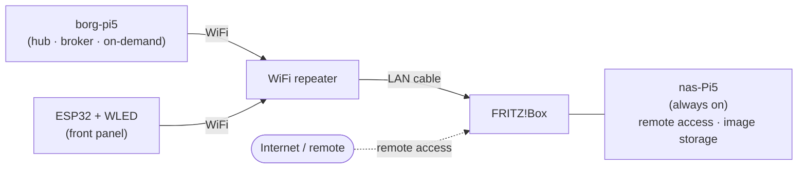
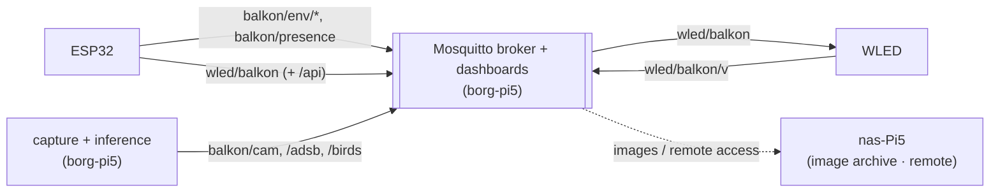
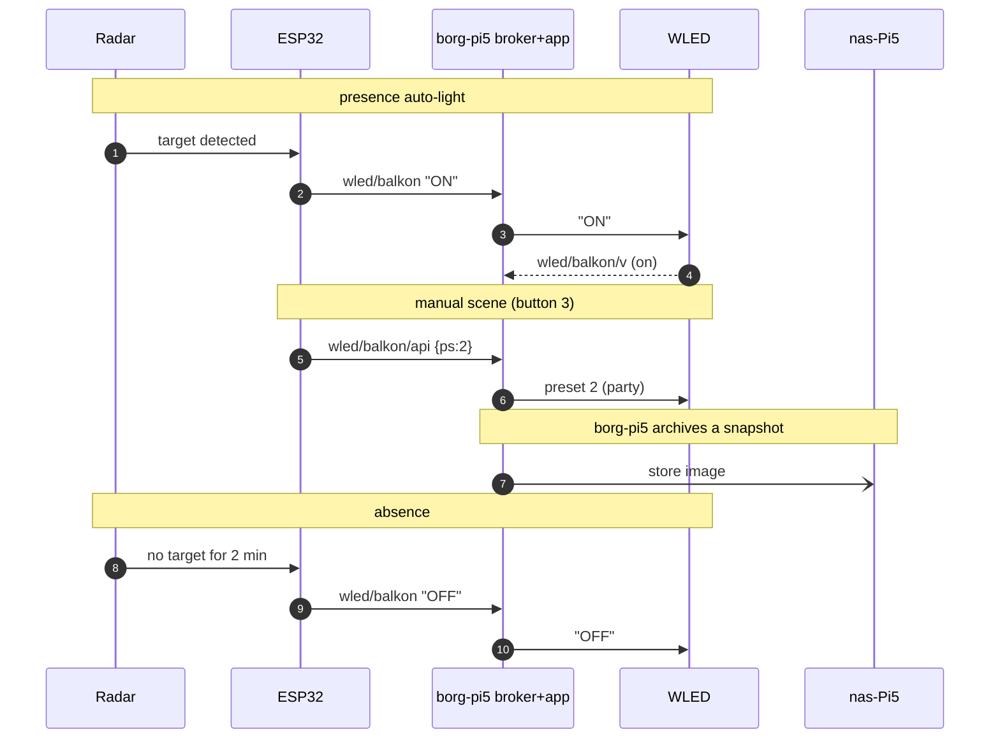

# Network

How the pieces talk, and which machine is on when.

## Roles

- **borg-pi5** — the Pi *inside the balcony enclosure* and **the hub the project is about**.
  Capture (camera/audio/SDR), local inference (Frigate, readsb/tar1090, BirdNET-Go), and the
  **MQTT broker (Mosquitto), dashboards and app**. **Powered on only when needed, not 24/7.**
  Reaches the LAN over WiFi via a repeater.
- **ESP32 + WLED** — the front panel (buttons, encoder, radar, environment) and the light
  controller. On WiFi; talk to the light and the broker over MQTT.
- **nas-Pi5** — a **separate, always-on** Raspberry Pi 5, **not** the enclosure Pi. Wired to
  the Fritz!Box. A **minor** helper only: the **remote-access point** (reach the unit from
  outside) and occasional **image/data storage**. It does not run the broker.

## Physical path

So: **borg-pi5 → WiFi repeater → (cable) → Fritz!Box → nas-Pi5.**

## Communication

- The **broker lives on the borg-pi5** (the hub). It runs the broker, the dashboards and
  the inference/app; it does not stream raw video/audio over the network.
- **ESP32** publishes sensor readings and controls the **WLED light over MQTT** (via the
  broker); button/encoder/radar actions become MQTT messages.
- The **whole unit powers as one**: one 5 V feed brings up the borg-pi5, the ESP32 and
  the WLED controller together, or none of them (there is no per-branch switching). So
  whenever the ESP32 or WLED is running, the broker on the borg-pi5 is up too — the
  broker-on-the-Pi placement costs nothing in practice, because there is no "Pi off but
  panel on" state. When the unit is off, everything is off (including WLED's own
  presets).
- **Remote access** from outside the home goes through the always-on **nas-Pi5** via the
  Fritz!Box, which also holds occasionally-stored images/data.

## Home network

Everything rides on the one **home network** (the Fritz!Box WiFi/LAN). Every device joins
it: the **borg-pi5**, the **ESP32** and the **WLED controller** over WiFi (via the
repeater), the **nas-Pi5** by cable. MQTT is just traffic on that LAN — there is no
separate device-to-device radio link.

## MQTT data flow

Topic scheme (target):

| Topic | Publisher → subscriber | Payload |
|---|---|---|
| `balkon/env/temperature` · `/humidity` · `/pressure` | ESP32 → dashboards | BME280 readings (live) |
| `balkon/env/recent` **(retained)** | borg-pi5 → app | timestamped BME280 trend buffer (U4), a few hours |
| `balkon/presence` | ESP32 → dashboards | radar target on/off |
| `wled/balkon` | ESP32 → WLED | command (`ON`/`OFF`/`T`) |
| `wled/balkon/api` | ESP32 → WLED | JSON (`bri`, `ps`) |
| `wled/balkon/v` | WLED → dashboards | light state |
| `balkon/cam/events` | borg-pi5 → dashboards | Frigate detections |
| `balkon/adsb/aircraft` | borg-pi5 → dashboards | readsb aircraft |
| `balkon/birds/detections` | borg-pi5 → dashboards | BirdNET species |
| `balkon/ism/recent` **(retained)** | borg-pi5 → dashboards | `rtl_433` ISM sensor decode (U13), last ~50 |
| `balkon/tpms/recent` **(retained)** | borg-pi5 → dashboards | `rtl_433` TPMS decode (U13), last ~50 |
| `balkon/aprs/recent` **(retained)** | borg-pi5 → dashboards | APRS stations heard (U15), last ~50 |
| `balkon/radiosonde/recent` **(retained)** | borg-pi5 → dashboards | radiosonde telemetry (U16), last ~50 |
| `balkon/noaa/image` **(retained)** | borg-pi5 → app | NOAA APT image ready (U14): id/timestamp/HTTP URL, image not archived on the Pi |
| `balkon/iss/sstv/image` **(retained)** | borg-pi5 → app | ISS SSTV image ready (U14): id/timestamp/HTTP URL |
| `balkon/meteor/recent` **(retained)** | borg-pi5 → dashboards | GRAVES meteor-scatter pings (U14), last ~50 |

(The ESP32 currently uses ESPHome MQTT discovery for its own sensor topics, plus the
explicit `wled/balkon` topics.)

Everything passes through the broker on the borg-pi5:

A typical evening at the table, over time:

## Consequences

- The **borg-pi5 is the hub**: broker, dashboards, inference and the light/MQTT automation
  all live on it. While it is powered down, those are unavailable (a deliberate trade-off
  for keeping everything on the central unit).
- The **nas-Pi5** only stays reachable 24/7 for **remote access** and holds occasionally
  **archived images/data** — it is not required for the unit to run.
