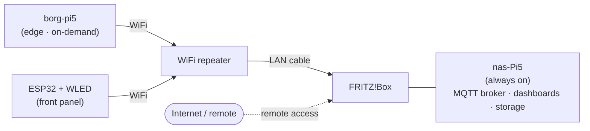
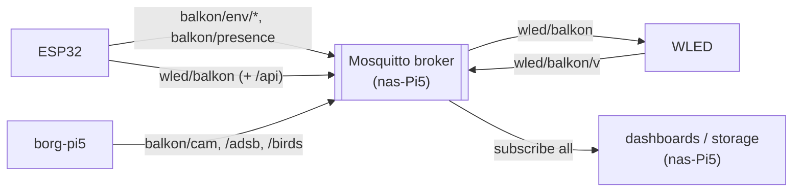
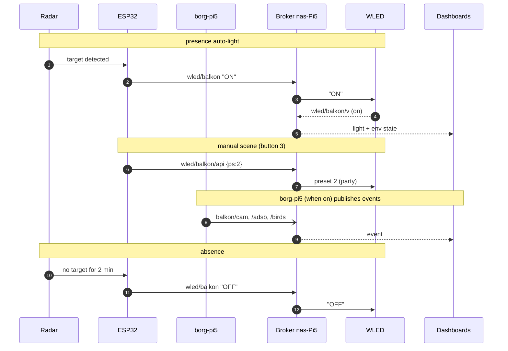

# Network

How the pieces talk, and which machine is on when.

## Roles

- **borg-pi5** — the edge Pi *inside the balcony enclosure*. Capture (camera/audio/SDR) and
  local inference (Frigate, readsb/tar1090, BirdNET-Go). **Powered on only when needed,
  not 24/7.** Reaches the LAN over WiFi via a repeater.
- **ESP32 + WLED** — the front panel (buttons, encoder, radar, environment) and the light
  controller. On WiFi; talk to the light and the broker over MQTT.
- **nas-Pi5** — a **separate, always-on** Raspberry Pi 5, **not** the enclosure Pi. Wired
  to the Fritz!Box. Runs the **MQTT broker (Mosquitto)**, dashboards and storage, and is the
  **permanent and remote (from outside) access point** — everything is reached through it.

## Physical path

So: **borg-pi5 → WiFi repeater → (cable) → Fritz!Box → nas-Pi5.**

## Communication

- The **broker lives on the nas-Pi5**. Because it is always on, the bus is always up even
  when the borg-pi5 is off.
- **borg-pi5** publishes events/metadata (detections, aircraft, birds) to the broker while
  it is running; it does not stream raw video/audio over the network.
- **ESP32** publishes sensor readings and controls the **WLED light over MQTT** (via the
  broker); button/encoder/radar actions become MQTT messages.
- **Remote access** (dashboards, status, control from outside the home) goes through the
  **nas-Pi5** via the Fritz!Box — the borg-pi5 is never exposed directly.

## Home network

Everything rides on the one **home network** (the Fritz!Box WiFi/LAN). Every device joins
it: the **borg-pi5**, the **ESP32** and the **WLED controller** over WiFi (via the
repeater), the **nas-Pi5** by cable. MQTT is just traffic on that LAN — there is no
separate device-to-device radio link.

## MQTT data flow

Topic scheme (target):

| Topic | Publisher → subscriber | Payload |
|---|---|---|
| `balkon/env/temperature` · `/humidity` · `/pressure` | ESP32 → dashboards | BME280 readings |
| `balkon/presence` | ESP32 → dashboards | radar target on/off |
| `wled/balkon` | ESP32 → WLED | command (`ON`/`OFF`/`T`) |
| `wled/balkon/api` | ESP32 → WLED | JSON (`bri`, `ps`) |
| `wled/balkon/v` | WLED → dashboards | light state |
| `balkon/cam/events` | borg-pi5 → dashboards | Frigate detections |
| `balkon/adsb/aircraft` | borg-pi5 → dashboards | readsb aircraft |
| `balkon/birds/detections` | borg-pi5 → dashboards | BirdNET species |

(The ESP32 currently uses ESPHome MQTT discovery for its own sensor topics, plus the
explicit `wled/balkon` topics.)

Everything passes through the broker on the nas-Pi5:

A typical evening at the table, over time:

## Consequences

- Anything that must be reachable 24/7 (broker, dashboards, remote access) belongs on the
  **nas-Pi5**, not the borg-pi5.
- On-demand edge jobs (camera recognition, ADS-B, bird logging) run on the **borg-pi5** and
  are simply unavailable while it is powered down — the rest of the system keeps working.
