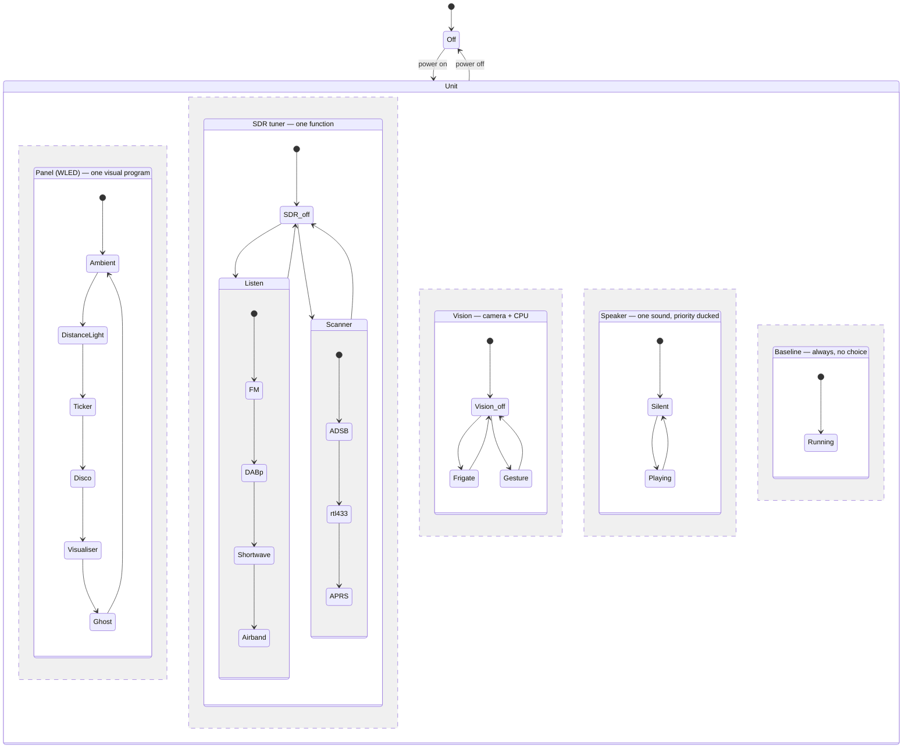

# Architecture — Balkon-Borg software stack (Gesamtkonzept)

**Status: proposal, under joint review.** This ties the scattered mode/priority
decisions in [`log/decisions.md`](log/decisions.md) and the use-case placement in
[`../docs/use-cases.md`](../docs/use-cases.md) into one coherent picture, and
sanity-checks it for contradictions. Nothing here is built yet. Where this proposes
something *new* (not already in the decision log), it is marked **[NEW – confirm]**.

---

## 1. Components and where they run

| Component | Host | Powered | Role |
|---|---|---|---|
| **Mode arbiter** ("the brain") | borg-pi5 | on-demand | owns `balkon/mode`, resolves pin-vs-auto, applies the mode→settings config |
| **MQTT broker** (Mosquitto) | borg-pi5 | on-demand | the bus everything talks over |
| **Frigate** | borg-pi5 | on-demand | camera object detection (radar-gated) |
| **MediaPipe** | borg-pi5 | on-demand | hand-gesture input (radar-gated) |
| **readsb / radio decoders** | borg-pi5 | on-demand | the single SDR tuner's consumers |
| **BirdNET-Go** | borg-pi5 | on-demand | continuous bird-call log |
| **Dashboards / audio out (TTS, clips)** | borg-pi5 | on-demand | Grafana/tar1090; USB sound → amp → speaker |
| **Light loop** (buttons, encoder, radar, BME → WLED) | ESP32 (ESPHome) | **always on** | the fast, human-facing control loop |
| **WLED controller** | Athom board | **always on** | the light; own onboard presets run independently |
| **App** | phone (Flutter) | user's phone | full control surface, reads/writes mode over MQTT |
| **Remote access + image store** | nas-Pi5 | **always on** | minor helper, not the broker |

Physical/network path is in [`../docs/network.md`](../docs/network.md).

---

## 2. Power model: all on, or all off

The **whole unit powers as one** off the single 5 V feed — borg-pi5, ESP32 and WLED
come up together or not at all; there is no per-branch switch. There is therefore **no
"Pi off but panel on" state**, which dissolves what looked like a coupling problem:
because the broker (on the Pi) is up whenever the ESP32 and WLED are, the ESP→broker→
WLED path is always intact when it matters. Broker-on-the-Pi costs nothing here.

Consequence for the design: "baseline runs while the Pi is powered" simply means
"whenever the unit is on." Nothing needs to survive a partial power state, because
there isn't one. (This corrects an earlier assumption that WLED was independently
powered and ran its own presets while the Pi was off — it does not; when the unit is
off, everything including WLED is off.)

---

## 3. The mode model: combinable features, resource-gated  **[REVISED – confirm]**

**Correction to the earlier "one exclusive main mode" model.** Modes are **not**
mutually exclusive. Features run **in parallel** and are toggled independently — the
user's examples: *Ambient light + airband listening* together, or *airband off but
Ambient on*. Only *some* combinations clash, and always for the same reason: **two
features that need the same exclusive resource cannot both run.** Ambient (the lamp)
and airband (the tuner + speaker) share nothing, so they coexist; two radio features
(both the tuner) do not.

So the real model is:

- A set of **independently toggleable features** (the former submodes — Distance light,
  Info ticker, FM, airband, ADS-B decode, gesture, Frigate, effects, …).
- A small set of **exclusive resources** they contend for.
- A rule: **two features are compatible iff their exclusive-resource sets are
  disjoint.** Conflicts are not arbitrary pairs — they fall out of the resource map.

"Modes" (Licht / Party / Radio / Scanner / Away) survive only as **presets**: named,
convenient bundles of feature toggles (e.g. Party = effects on + visualiser on). You
start from a preset and can toggle individual features on/off, as long as the resource
allocator permits. Buttons cycle presets; the app toggles individual features.

The right tool to figure out what clashes is therefore **not an N×N feature-vs-feature
matrix** (large, and it hides *why* two things clash) but a **resource-allocation
table**: map each feature to the exclusive resources it needs, and the conflicts derive
themselves. That table is §4, and it is the thing to complete together.

### The exclusive resources are independent axes

Each exclusive resource is really an **axis**: you pick at most one value on it, and the
axes are independent, so they combine freely. There are four:

- **Panel** (the WLED LEDs — they *are* both the ambient lamp and the 2D matrix, so it
  runs one visual program at a time): Ambient · Distance-light+bar · Ticker · Disco ·
  Visualiser · Ghost.
- **SDR tuner**: off · Listen (FM/DAB+/shortwave/airband) · Scanner (ADS-B/rtl_433/
  APRS/…).
- **Vision** (camera + heavy CPU): off · Frigate/Away · Gesture.
- **Speaker** (one sound at a time, priority-ducked, §5): silent · playing.

You set each axis and leave it; a light effect persists regardless of what the radio is
doing (user: *"Disko ist Disko, egal ob ich Radio, Flugfunk oder live singe"*). Presets
are just convenient one-tap settings across several axes at once. Plus an always-on
**baseline** (BME log, BirdNET, time-lapse) that has no choice to make.

Because the axes are concurrent and each is internally exclusive, the natural picture is
a **state diagram with parallel regions** — which directly answers "can we draw this as
mermaid?": yes, and this orthogonal-region form *is* the honest one (parallelism between
regions = features combine; one active state per region = the resource is exclusive):

The within-region arrows are just the button-cycle order; the app can jump any region to
any state directly. The state names (FM, Airband, ADS-B, …) are the "Subzustände" —
substates of the Listen/Scanner composite states.

---

## 4. Resource-allocation table (draft — to complete together)

Same information as the diagram, in the form that becomes the implementation. **Four
exclusive resources** (● = needs it, one user at a time): **Panel** (the WLED LEDs, one
visual program) · **SDR** tuner · **Vision** (camera + heavy CPU) · **Speaker** (one
sound, priority-ducked per §5). **Shared** (○, never a conflict): **Mic** (fan-out to
BirdNET + clap + FFT + intercom at once); BME/dashboards/logging need nothing scarce.

| Feature | Panel | SDR | Vision | Speaker | Mic |
|---|:--:|:--:|:--:|:--:|:--:|
| Ambient / warm light | ● | | | | |
| Distance light + bar (U1) | ● | | | | |
| Info ticker (U3) | ● | reads¹ | | | |
| Disco / effects (U3) | ● | | | | |
| Music visualiser (U3) | ● | | | | ○ |
| Presence ghost (U19) | ● | | | | |
| Radio listen — FM/DAB/SW/airband (U10, U20.2) | | ● | | ● | |
| Scanner decode — ADS-B/rtl_433/APRS/… (U5,U13,U15,U16,U8) | | ● | | | |
| Gesture (U2) | | | ● | | |
| Frigate / Away (U7, U11) | | | ● | ●² | |
| TTS feedback (U9) | | | | ● | |
| Intercom (U12) | | | | ● | ○ |
| BirdNET (U6), clap (U2) | | | | | ○ |
| Env log (U4), time-lapse (U18) | | | | | |

¹ The ticker's *flight* line needs live ADS-B, i.e. the Scanner holding the tuner — so
a full ticker + any Radio feature clash on the tuner (the ticker's time/temp lines
don't). ² Only the alarm; Away is otherwise silent.

**Reading the conflicts off the table** (same ● in an exclusive column = clash;
disjoint = run in parallel):
- **Panel:** the six visual programs are mutually exclusive — one look at a time
  (Ambient / Distance / Ticker / Disco / Visualiser / Ghost). The ghost owns the whole
  panel like any other, per the user ("für sich, in diesem Modus").
- **SDR:** Radio ⟂ Scanner ⟂ full Info-ticker — the tuner is the dominant bottleneck.
- **Vision:** Gesture ⟂ Frigate/Away — never both.
- **Speaker:** Radio, TTS, intercom, alarm don't *hard*-clash — they queue by priority
  (§5), one sound at a time.
- **Across axes: free.** Disco (Panel) + airband (SDR+Speaker) + BirdNET (Mic) + env
  log, all at once — exactly the user's "Disko ist Disko, egal was der Empfänger tut."

The only cells still genuinely open are edge refinements (e.g. should the panel ever be
*segmented* so a tiny status row coexists with a main program — deferred; one program
per panel for now).

---

## 5. Overlay priority model  **[NEW – confirm]**

Overlays interrupt whatever is playing. Proposed order, highest wins the speaker and
re-asserts until its condition clears:

1. **Alarm** (U11 security) — interrupts everything; keeps re-asserting until cleared
   or acknowledged.
2. **Safety warning** (U9.3 storm, U10.4 DAB EWF) — ducks/interrupts media + feedback;
   brief and time-sensitive.
3. **Intercom** (U12) — two-way comms; ducks radio/media while a call is active.
4. **Event feedback / TTS** (U9 bird name, flight) — plays only when nothing above is
   active; ducks radio for a couple of seconds.
5. **Ambient** (U19 presence ghost) — visual only, never makes sound; yields the
   matrix to any submode/overlay that needs it.

**Human override always wins:** an explicit app/button action is honoured immediately
(it pins the mode, §6) — except the alarm, which re-asserts until the security
condition itself is resolved. The exact ordering of 2 vs 3 (does a storm warning cut
into a live intercom call?) is the main thing to confirm here.

---

## 6. Mode changes — who writes the mode

- **Manual pin:** app or Button 3 sets `balkon/mode` explicitly → it stays until
  changed or released (Button 3 long-press) back to automatic.
- **Automatic:** with no active pin, the arbiter picks the mode from triggers (radar
  pattern, time of day, presence/absence, geofence for Away).
- **One writer:** only the arbiter (on the borg-pi5) writes `balkon/mode`, to avoid
  competing writers.
- **Buttons vs app:** Button 3 cycles main modes, Button 2 cycles submodes within the
  current main mode — a curated subset. The app addresses the full space, including
  submodes with no button shortcut.

Priority answer to the old open question: **app/manual > automation** while pinned.

---

## 7. Data flow (MQTT)

Topic scheme is in [`../docs/network.md`](../docs/network.md); the mode layer adds
`balkon/mode` (main) and `balkon/mode/sub` (submode), written only by the arbiter,
read by every mode-dependent service and by the app. The mode→per-service settings
map is a central declarative config (likely `shared/`, format TBD).

---

## 8. Open questions / risks (ranked)

1. **Confirm the combinable-feature model (§3)** and **complete the resource table
   (§4)** together — this replaces the earlier "one exclusive main mode" framing and is
   now the core of the architecture.
2. **Overlay priority (§5)** — confirm the ordering, especially safety-warning vs
   intercom.
3. **SDR data freshness** — the tuner is the dominant bottleneck; decide whether
   ADS-B/Scanner is its idle default so the flight ticker / sensor net stay live when
   no other radio feature is on.
4. **Presets** — define the named feature bundles (Licht/Party/Radio/Scanner/Away) and
   the per-feature settings + automatic-trigger heuristics.
5. **Config format and home** for the feature/preset/settings map.
6. **Stack/language for `pi/`** — the resource allocator + glue; not chosen yet.

*Resolved:* the Pi-power coupling worry (§2) is void — the unit is all-on/all-off, so
there is no partial-power state to design around.
