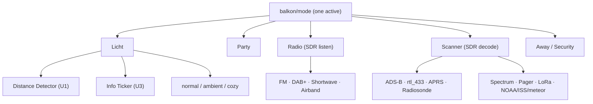

# Architecture — Balkon-Borg software stack (Gesamtkonzept)

**Status: proposal, under joint review.** This ties the scattered mode/priority
decisions in [`log/decisions.md`](log/decisions.md) and the use-case placement in
[`../docs/use-cases.md`](../docs/use-cases.md) into one coherent picture, and
sanity-checks it for contradictions. Nothing here is built yet. Where this proposes
something *new* (not already in the decision log), it is marked **[NEW – confirm]**.

---

## 1. Components and where they run

| Component | Host | Powered | Role |
|---|---|---|---|
| **Mode arbiter** ("the brain") | borg-pi5 | on-demand | owns `balkon/mode`, resolves pin-vs-auto, applies the mode→settings config |
| **MQTT broker** (Mosquitto) | borg-pi5 | on-demand | the bus everything talks over |
| **Frigate** | borg-pi5 | on-demand | camera object detection (radar-gated) |
| **MediaPipe** | borg-pi5 | on-demand | hand-gesture input (radar-gated) |
| **readsb / radio decoders** | borg-pi5 | on-demand | the single SDR tuner's consumers |
| **BirdNET-Go** | borg-pi5 | on-demand | continuous bird-call log |
| **Dashboards / audio out (TTS, clips)** | borg-pi5 | on-demand | Grafana/tar1090; USB sound → amp → speaker |
| **Light loop** (buttons, encoder, radar, BME → WLED) | ESP32 (ESPHome) | **always on** | the fast, human-facing control loop |
| **WLED controller** | Athom board | **always on** | the light; own onboard presets run independently |
| **App** | phone (Flutter) | user's phone | full control surface, reads/writes mode over MQTT |
| **Remote access + image store** | nas-Pi5 | **always on** | minor helper, not the broker |

Physical/network path is in [`../docs/network.md`](../docs/network.md).

---

## 2. Resilience: what works when the borg-pi5 is off  ⚠️

**This is the load-bearing check.** The borg-pi5 is deliberately **not 24/7**, yet it
hosts both the broker and the mode brain. As currently specified (broker on the Pi,
ESP→WLED *over MQTT via that broker*), the chain breaks the moment the Pi is off:

```
ESP32 --(MQTT)--> [broker on borg-pi5 = OFF] --(MQTT)--> WLED     ✗ broken
```

So with the Pi off, **U1 (automatic table light) — the flagship everyday use case —
does not work**, nor does button-driven mode switching. Only WLED's own onboard time
presets run. This is already noted as a consequence in `network.md`, but it deserves
to be a conscious decision, not a side effect, because it makes the most-used feature
depend on powering the whole Pi.

**[NEW – confirm] Proposed fix: decouple the basic light loop from the Pi.** Let the
ESP32 drive WLED **directly on the LAN** (WLED's HTTP/JSON API, or a broker-less local
link) for the core light loop, and use the Pi's MQTT broker only for telemetry and for
the *mode* layer. Then:

- **Pi off:** the ESP32 runs U1 (presence + distance dimming, the proximity bar,
  departure flicker) entirely on its own, talking straight to WLED. Basic, automatic
  table light always works. No modes, no gesture, no radio — just the light.
- **Pi on:** the full mode system layers on top; the arbiter can still command WLED
  (via the ESP or directly) per the active mode.

This is a clean graceful-degradation story: the always-on parts (ESP + WLED) deliver
the daily-driver feature without the Pi, and the Pi adds the rich modes when it's up.
The alternative is to accept "no light automation unless the Pi is on" — a legitimate
choice, but it should be made on purpose.

---

## 3. The mode system

One global **main mode** (`balkon/mode`), and within it one **submode**
(`balkon/mode/sub`). Exactly one of each is active; both are mutually exclusive at
their level, which is what arbitrates shared resources (§4).



Around the modes sit four non-mode layers (full mapping in
[`../docs/use-cases.md`](../docs/use-cases.md) → "Mode placement"):

- **Baseline** — always on while the Pi runs: environment logging (U4), BirdNET (U6),
  daily time-lapse frame (U18).
- **Shared services** — used *by* modes: camera/Frigate (radar-gated, U7), the
  speaker path.
- **Overlays / interrupts** — event-driven, cut across the active mode (§5).
- **Control surface** — buttons/clap/gesture (U2) and the app; not a mode.

*Night* is a modifier (shifts thresholds/scenes inside the active mode), not a main
mode.

---

## 4. Resource arbitration — who resolves each conflict

| Scarce resource | Contenders | Arbiter |
|---|---|---|
| **SDR tuner** (one) | ADS-B, FM/DAB/SW, airband, rtl_433, APRS, … | **main mode** (Radio xor Scanner xor neither) |
| **Heavy CPU** | Frigate vs MediaPipe gesture | **main mode** (Away uses Frigate; Licht+gesture uses MediaPipe — never both) |
| **Matrix rows** | proximity bar vs ticker vs effects | **submode** (Distance Detector xor Info Ticker within Licht) |
| **Speaker** | radio, TTS feedback, intercom, alarm | **overlay priority** (§5) |
| **Camera** | Frigate, MediaPipe, time-lapse | **radar-gated shared service** + main mode |

The design principle: **inside a main mode**, express competing behaviours as
mutually-exclusive submodes; **across main modes**, the single global resources (tuner,
heavy CPU) are the main mode's job. Only the speaker genuinely needs a cross-mode
priority rule, because overlays (alarm, warnings, intercom, feedback) can fire during
*any* mode.

---

## 5. Overlay priority model  **[NEW – confirm]**

Overlays interrupt whatever is playing. Proposed order, highest wins the speaker and
re-asserts until its condition clears:

1. **Alarm** (U11 security) — interrupts everything; keeps re-asserting until cleared
   or acknowledged.
2. **Safety warning** (U9.3 storm, U10.4 DAB EWF) — ducks/interrupts media + feedback;
   brief and time-sensitive.
3. **Intercom** (U12) — two-way comms; ducks radio/media while a call is active.
4. **Event feedback / TTS** (U9 bird name, flight) — plays only when nothing above is
   active; ducks radio for a couple of seconds.
5. **Ambient** (U19 presence ghost) — visual only, never makes sound; yields the
   matrix to any submode/overlay that needs it.

**Human override always wins:** an explicit app/button action is honoured immediately
(it pins the mode, §6) — except the alarm, which re-asserts until the security
condition itself is resolved. The exact ordering of 2 vs 3 (does a storm warning cut
into a live intercom call?) is the main thing to confirm here.

---

## 6. Mode changes — who writes the mode

- **Manual pin:** app or Button 3 sets `balkon/mode` explicitly → it stays until
  changed or released (Button 3 long-press) back to automatic.
- **Automatic:** with no active pin, the arbiter picks the mode from triggers (radar
  pattern, time of day, presence/absence, geofence for Away).
- **One writer:** only the arbiter (on the borg-pi5) writes `balkon/mode`, to avoid
  competing writers.
- **Buttons vs app:** Button 3 cycles main modes, Button 2 cycles submodes within the
  current main mode — a curated subset. The app addresses the full space, including
  submodes with no button shortcut.

Priority answer to the old open question: **app/manual > automation** while pinned.

---

## 7. Data flow (MQTT)

Topic scheme is in [`../docs/network.md`](../docs/network.md); the mode layer adds
`balkon/mode` (main) and `balkon/mode/sub` (submode), written only by the arbiter,
read by every mode-dependent service and by the app. The mode→per-service settings
map is a central declarative config (likely `shared/`, format TBD).

---

## 8. Open questions / risks (ranked)

1. **Pi-power coupling (§2)** — decide: decouple the basic light loop (ESP↔WLED
   direct) so U1 survives the Pi being off, or consciously accept "no light automation
   without the Pi." Biggest single decision here.
2. **Overlay priority (§5)** — confirm the ordering, especially safety-warning vs
   intercom.
3. **SDR data freshness** — with neither Radio nor Scanner as the idle default,
   SDR-derived data (U3.2 flight ticker, U13 sensor net) is stale outside Scanner.
   Decide whether ADS-B/Scanner is the tuner's idle default.
4. **Per-mode settings + automatic-trigger heuristics** — still to be defined per mode.
5. **Config format and home** for the mode→settings map.
6. **Stack/language for `pi/`** — the arbiter + glue; not chosen yet.
