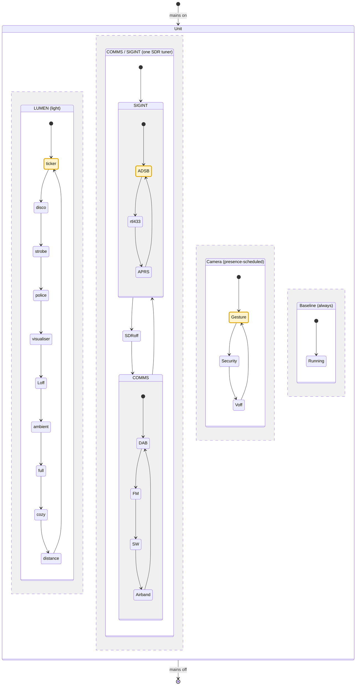
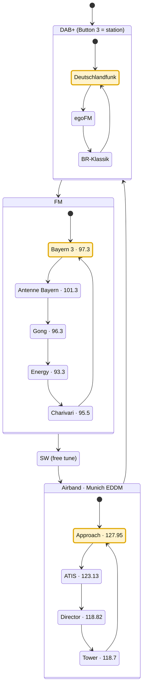

# Architecture — Balkon-Borg software stack (Gesamtkonzept)

**Status: proposal, under joint review.** This ties the scattered mode/priority
decisions in [`log/decisions.md`](log/decisions.md) and the use-case placement in
[`../docs/use-cases.md`](../docs/use-cases.md) into one coherent picture, and
sanity-checks it for contradictions. Nothing here is built yet. Where this proposes
something *new* (not already in the decision log), it is marked **[NEW – confirm]**.

---

## 1. Components and where they run

"With unit" = powered when the unit is on; the whole box is all-on/all-off (§2), so
only the nas-Pi5 is truly always-on.

| Component | Host | Powered | Role |
|---|---|---|---|
| **Mode arbiter** ("the brain") | borg-pi5 — Python, host systemd service | with unit | owns `balkon/mode`, resolves pin-vs-auto, applies the YAML config, starts/stops the service quadlets to enforce exclusivity |
| **MQTT broker** (Mosquitto) | borg-pi5 | with unit | the bus everything talks over |
| **System monitor:** Netdata | borg-pi5 | with unit | CPU/temp/health, own UI (watch the thermals under vision load) |
| **Frigate** | borg-pi5 | with unit | security surveillance (~2 FPS while absent); own UI |
| **MediaPipe** | borg-pi5 | with unit | gesture input while present |
| **readsb/tar1090 + radio decoders** | borg-pi5 | with unit | the single SDR tuner's consumers (COMMS xor SIGINT) |
| **BirdNET-Go** | borg-pi5 | with unit | bird-call log, own UI |
| **Audio out** (TTS, clips) | borg-pi5 | with unit | USB sound → amp → speaker |
| **Light loop** (buttons, encoder, radar, BME → WLED) | ESP32 (ESPHome) | with unit | the fast, human-facing control loop |
| **WLED controller** | Athom board | with unit | the light |
| **App** | phone (Flutter) | user's phone | full control surface; sends commands + reads state over MQTT |
| **Remote access + image store** | nas-Pi5 | **always on** | minor helper, not the broker |

Physical/network path is in [`../docs/network.md`](../docs/network.md).

---

## 2. Power model: all on, or all off

The **whole unit powers as one** off the single 5 V feed — borg-pi5, ESP32 and WLED
come up together or not at all; there is no per-branch switch. There is therefore **no
"Pi off but panel on" state**, which dissolves what looked like a coupling problem:
because the broker (on the Pi) is up whenever the ESP32 and WLED are, the ESP→broker→
WLED path is always intact when it matters. Broker-on-the-Pi costs nothing here.

Consequence for the design: "baseline runs while the Pi is powered" simply means
"whenever the unit is on." Nothing needs to survive a partial power state, because
there isn't one. (This corrects an earlier assumption that WLED was independently
powered and ran its own presets while the Pi was off — it does not; when the unit is
off, everything including WLED is off.)

---

## 3. The mode model: combinable features, resource-gated  **[REVISED – confirm]**

**Correction to the earlier "one exclusive main mode" model.** Modes are **not**
mutually exclusive. Features run **in parallel** and are toggled independently — the
user's examples: *Ambient light + airband listening* together, or *airband off but
Ambient on*. Only *some* combinations clash, and always for the same reason: **two
features that need the same exclusive resource cannot both run.** Ambient (the lamp)
and airband (the tuner + speaker) share nothing, so they coexist; two radio features
(both the tuner) do not.

So the real model is:

- A set of **independently toggleable features** (the former submodes — Distance light,
  Info ticker, FM, airband, ADS-B decode, gesture, Frigate, effects, …).
- A small set of **exclusive resources** they contend for.
- A rule: **two features are compatible iff their exclusive-resource sets are
  disjoint.** Conflicts are not arbitrary pairs — they fall out of the resource map.

The **main modes** (LUMEN / COMMS / SIGINT / SENTRY) are the user-facing grouping of these
features: **parallel and independent**, each always in an active submode, and **every
submode list includes an explicit off** (that is how a main mode is switched off). They
map to the buttons (Button 1 = focus/main mode, 2 = submode incl. off, 3 = sub-submode,
4 = reserve — see `docs/use-cases.md` U2). "Focus" is which main mode the buttons steer;
the others keep running (LUMEN off + COMMS on, or the reverse). There is no separate
"Party" main mode — its effects (disco/strobe/police/visualiser) are LUMEN submodes, one
flat program list. **Displacement on resource conflict only:** where two main modes need
the same exclusive resource (COMMS and SIGINT on the one tuner), turning one on displaces
the other to off; otherwise they coexist. Named cross-axis *presets* (a one-tap "evening")
can still exist on top, app-driven.

The right tool to figure out what clashes is therefore **not an N×N feature-vs-feature
matrix** (large, and it hides *why* two things clash) but a **resource-allocation
table**: map each feature to the exclusive resources it needs, and the conflicts derive
themselves. That table is §4, and it is the thing to complete together.

### The exclusive resources are independent axes

Each exclusive resource is really an **axis**: you pick at most one value on it, and the
axes are independent, so they combine freely. There are four:

- **Panel** (the WLED LEDs — they *are* both the ambient lamp and the 2D matrix, so it
  runs one visual program at a time): off · ambient · full · cozy · distance-auto ·
  ticker · disco · strobe · police · visualiser.
- **SDR tuner**: off · Listen (FM/DAB+/shortwave/airband) · SIGINT (ADS-B/rtl_433/
  APRS/…).
- **Vision** (camera + heavy CPU): off · MediaPipe (gesture) · Frigate (security).
  This axis is **presence-scheduled**, not manually cycled: while the radar sees
  someone — and for a **30-minute hold** after they were last seen — Vision runs
  **MediaPipe** (interaction/gesture). Once the hold expires (really nobody there),
  Vision switches to **Frigate at ~2 FPS** (1 frame / 0.5 s) for security. Never both,
  and 2 FPS keeps CPU-only Frigate trivial. So MediaPipe and Frigate are two tools for
  two different jobs (fine-grained gesture vs. surveillance/recording), time-shared by
  presence rather than competing.
- **Speaker** (one sound at a time, priority-ducked, §5): silent · playing.

You set each axis and leave it; a light effect persists regardless of what the radio is
doing (user: *"Disko ist Disko, egal ob ich Radio, Flugfunk oder live singe"*). Presets
are just convenient one-tap settings across several axes at once. Plus an always-on
**baseline** (BME log, BirdNET, time-lapse) that has no choice to make.

The same picture, drawn in the **user-facing mode vocabulary** so the modes are easy to
read: a **state diagram with parallel regions**, one region per main mode. Parallelism
between regions = the modes run at once (LUMEN + COMMS together); one active state per
region = a mode is in exactly one submode. Each region's **power-on default is
highlighted** (amber, §7): LUMEN boots into *ticker* (you see it's on, but it isn't
distracting), the SDR into **SIGINT / ADS-B idle** (so the flight ticker stays live),
the camera into *gesture* (you are present when you switch the unit on). **COMMS and SIGINT share the one SDR tuner, so they are two branches
of a single region** — a COMMS station *or* a SIGINT function *or* off, never two at once:
the displacement, shown natively. Button 1 picks the focus, Button 2 the submode, Button 3
the sub-submode (station / frequency), Button 4 is reserve.

The SDR-listen submodes (COMMS) carry a **Munich station list** on Button 3, each
submode's default highlighted (DAB+ → Deutschlandfunk, FM → Bayern 3, airband →
Approach); COMMS itself defaults to **DAB+ / Deutschlandfunk**. Shortwave is a free tune,
no preset list:

Within-region arrows are the Button-2 (and Button-3) cycle order; the app can jump to any
state. The **Camera** region is presence-scheduled (gesture while present, security/SENTRY
while absent), not button-cycled; the speaker is an output (volume on the encoder), not a
mode.

---

## 4. Resource-allocation table (draft — to complete together)

Same information as the diagram, in the form that becomes the implementation. **Four
exclusive resources** (● = needs it, one user at a time): **Panel** (the WLED LEDs, one
visual program) · **SDR** tuner · **Vision** (camera + heavy CPU) · **Speaker** (one
sound, priority-ducked per §5). **Shared** (○, never a conflict): **Mic** (fan-out to
BirdNET + clap + FFT + intercom at once); BME/dashboards/logging need nothing scarce.

| Feature | Panel | SDR | Vision | Speaker | Mic |
|---|:--:|:--:|:--:|:--:|:--:|
| Ambient / warm light | ● | | | | |
| Distance light + bar (U1) | ● | | | | |
| Info ticker (U3) | ● | reads¹ | | | |
| Disco / effects (U3) | ● | | | | |
| Music visualiser (U3) | ● | | | | ○ |
| Presence ghost (U19) | ● | | | | |
| COMMS listen — FM/DAB/SW/airband (U10, U20.2) | | ● | | ● | |
| SIGINT decode — ADS-B/rtl_433/APRS/… (U5,U13,U15,U16,U8) | | ● | | | |
| Gesture (U2) | | | ● | | |
| Frigate / SENTRY (U7, U11) | | | ● | ●² | |
| TTS feedback (U9) | | | | ● | |
| Intercom (U12) | | | | ● | ○ |
| BirdNET (U6), clap (U2) | | | | | ○ |
| Env log (U4), time-lapse (U18) | | | | | |

¹ The ticker's *flight* line needs live ADS-B, i.e. the SIGINT holding the tuner — so
a full ticker + any COMMS feature clash on the tuner (the ticker's time/temp lines
don't). ² Only the alarm; SENTRY is otherwise silent.

**Reading the conflicts off the table** (same ● in an exclusive column = clash;
disjoint = run in parallel):
- **Panel:** the six visual programs are mutually exclusive — one look at a time
  (Ambient / Distance / Ticker / Disco / Visualiser / Ghost). The ghost owns the whole
  panel like any other, per the user ("für sich, in diesem Modus").
- **SDR:** COMMS ⟂ SIGINT ⟂ full Info-ticker — the tuner is the dominant bottleneck.
- **Vision:** Gesture ⟂ Frigate/SENTRY — never both.
- **Speaker:** COMMS, TTS, intercom, alarm don't *hard*-clash — they queue by priority
  (§5), one sound at a time.
- **Across axes: free.** Disco (Panel) + airband (SDR+Speaker) + BirdNET (Mic) + env
  log, all at once — exactly the user's "Disko ist Disko, egal was der Empfänger tut."

The only cells still genuinely open are edge refinements (e.g. should the panel ever be
*segmented* so a tiny status row coexists with a main program — deferred; one program
per panel for now).

---

## 5. Overlay priority model

Overlays interrupt whatever is playing. **Confirmed** order (U9), highest wins the speaker
and re-asserts until its condition clears:

1. **Alarm** (U11 security) — interrupts everything; keeps re-asserting until cleared
   or acknowledged.
2. **Safety warning** (U9.3 storm, U10.4 DAB EWF) — ducks/interrupts media + feedback;
   brief and time-sensitive.
3. **Intercom** (U12) — two-way comms; ducks radio/media while a call is active.
4. **Event feedback / TTS** (U9 bird name, flight) — plays only when nothing above is
   active; ducks radio for a couple of seconds.
5. **Ambient** (U19 presence ghost) — visual only, never makes sound; yields the
   matrix to any submode/overlay that needs it.

**Human override always wins:** an explicit app/button action is honoured immediately
(it pins the mode, §6) — except the alarm, which re-asserts until the security
condition itself is resolved. **Confirmed:** a safety warning (2) **cuts into a live
intercom call** (3) — safety over comfort. TTS is **Piper** (local, offline); the arbiter
runs the ducking/queue mixer (see `../docs/use-cases.md` U9).

---

## 6. Mode changes — who writes the mode

- **Manual pin:** app or Button 3 sets `balkon/mode` explicitly → it stays until
  changed or released (Button 3 long-press) back to automatic.
- **Automatic:** with no active pin, the arbiter picks the mode from triggers (radar
  pattern, time of day, presence/absence, geofence for SENTRY).
- **One writer:** only the arbiter (on the borg-pi5) writes `balkon/mode`, to avoid
  competing writers.
- **Buttons vs app:** Button 3 cycles main modes, Button 2 cycles submodes within the
  current main mode — a curated subset. The app addresses the full space, including
  submodes with no button shortcut.

Priority answer to the old open question: **app/manual > automation** while pinned.

---

## 7. Power-on defaults (safe state)

The unit is all-on/all-off (§2), so every boot needs a defined, safe starting state —
nothing garish, loud or surprising, and no stale state carried across a power cycle. On
power-on the arbiter comes up in **automatic** (no manual pin ever survives a reboot),
and each axis takes a calm default:

These defaults are the **amber-highlighted states** in the §3 diagram.

| Mode / axis | Power-on default | Why |
|---|---|---|
| Mode / pin | **automatic**, sensor-driven, no pinned mode | a stale pin never outlives a power cycle |
| **LUMEN** (light) | **ticker** (info-ticker) | you can see the unit is on, but it isn't distracting — not a garish flash, not dark |
| **COMMS / SIGINT** (SDR) | **SIGINT / ADS-B idle** (silent) | ADS-B is the tuner's idle default so the flight ticker (U3.2) and sensor net stay live; no audio (SIGINT is data-only). Filtered to **low overflights near Laim**, not high cruisers (U5). Turning COMMS on displaces it. |
| **Camera** (Vision) | **gesture** (MediaPipe) | you are present when you flip the mains, so it comes up ready to read hand gestures; it hands over to security only after the absence hold |
| **SENTRY** (security) | **off** | you are home at power-on |
| **Speaker** | **silent** | no auto-play; only overlays (alarm/warning) may make sound |
| **Baseline** | up (BME log, BirdNET, Netdata) | always on, no choice |

Rationale: the box boots into a **visible-but-calm** state (the ticker shows it lives),
present-aware (camera on gesture), quiet (no sound), and already watching the sky (ADS-B
idle) — which also keeps the flight ticker fresh.

## 8. Data flow (MQTT)

Topic scheme is in [`../docs/network.md`](../docs/network.md); the mode layer adds
`balkon/mode` (main), `balkon/mode/sub` (submode) and `balkon/mode/chan` (the optional
**third level** — the channel/station list within a submode, e.g. the FM station or the
airband frequency; empty where a submode has no list). All three are written only by the
arbiter, read by every mode-dependent service and by the app. The mode→per-service
settings map is a central declarative config (likely `shared/`, format TBD).

**No telemetry database.** The unit's own live data (environment, presence, mode) stays
on MQTT; the arbiter keeps a short **in-RAM ring buffer** for recent trends (e.g. the
BME pressure trend for U4). The **app is the live dashboard**; each capture service keeps
its own UI (tar1090, BirdNET-Go, Frigate) and Netdata covers system health. Persisting
that live telemetry would be a data grave across the unit's downtime, so there is
deliberately no InfluxDB/Grafana. **The one persistent store** is **BirdNET-Go's own
SQLite** bird log (U6) — discrete species-sighting *events*, the service's native file
store, not our infra; the arbiter also records the unit's on-intervals there so bird
stats can be **uptime-normalised** (detections ÷ on-hours).

**Mic fan-out.** The USB mic is a **PipeWire** source (Pi OS default), read
**simultaneously and continuously** by several consumers without locking the device:
BirdNET (always), clap detection (U2.2), the visualiser FFT (U3.4), the intercom (U12).
This is the "always-open mic" that the shared-resource row in §4 refers to.

---

## 9. Open questions / risks (ranked)

1. **Overlay priority (§5)** — confirm the ordering, especially safety-warning vs
   intercom.
2. **Build order** — which use case to implement first (the user's sequencing call).
3. **Per-mode settings and optional app presets** — the concrete submode lists and their
   settings per main mode, plus the automatic-trigger heuristics (the Vision presence
   schedule and the SDR idle default are defined; the rest are not).
4. **Reverse proxy** for the several web UIs (Netdata, tar1090, Frigate, BirdNET-Go) —
   nice-to-have, minor.

*Resolved:* the **SDR idle default** — ADS-B (SIGINT), silent, filtered to low overflights
near Laim, so the flight ticker stays live and turning COMMS on displaces it.

*Resolved:* the Pi-power coupling worry (§2, unit is all-on/all-off); the combinable-
feature model + resource table (§3–4); the software stack (Python arbiter as a host
systemd service, YAML config in `shared/`, Netdata for system health, **no telemetry
DB** — live data on MQTT + an in-RAM ring buffer, the app as the dashboard, each service
its own UI; see the decision log); Frigate vs MediaPipe (both kept, time-shared on the
Vision axis by presence, §3).
